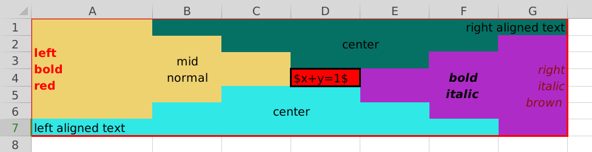

# Convert excel table to latex table

This tool convert excel table to latex table in human-readable format.

## Requirements

Please add the following required packages to your document preamble:

```tex
\usepackage{multirow, makecell}
```

Following python packages are needed:

```shell
pip install openpyxl
```

## Usage

```text
usage: excel2tex.py [-h] -s SOURCE -o TARGET

optional arguments:
  -h, --help  show this help message and exit
  -s SOURCE   source file (default: table.xlsx)
  -o TARGET   target file (default: table.tex)
  -e {utf-8,utf-8-sig}  file encoding (default: utf-8), if there is mess code, set it to utf-8-sig
```

## Note

You should obey some rules of how to create a table that can be successfully converted:

1. The height of every merged cell must be greater than the number of lines in your text.
2. Make sure that the height of every merged cell that cross rows is **even**.
3. Make sure that any two merged cell that cross rows do not intersect vertically, i.e., they have no cells sharing the same row.
4. Make the size of the merged cell suitable, i.e., do not give more space than that you need.

## Example

Here is a excel table



`main.tex`

```tex
\documentclass{article}
\usepackage{xeCJK}
\usepackage{multirow, makecell}

\begin{document}
\input{table.tex}
\end{document}
```

Generated `table.tex` by `python excel2tex.py -s table.xlsx -o table.tex`

```tex
% Please add the following required packages to your document preamble:
% \usepackage{multirow, makecell}
\begin{tabular}{*{5}{|c}|}
\hline
% row 1
  plain单元格
  & \multicolumn{2}{c|}{multicolumn测试}
  & \multicolumn{2}{c|}{block测试} \\
\hline
% row 2
  \multicolumn{2}{|c|}{不是}
  & \multirowcell{2}{multirow \\测试}
  & 6
  & 7 \\
\cline{1-2}
\cline{4-5}
% row 3
  1
  & 2
  &  & 8
  & 9 \\
\hline
% row 4
  3
  & 4
  & 5
  & \multirowcell{2}{A}
  & \multirowcell{2}{B} \\
\cline{1-3}
% row 5
  \multicolumn{3}{|c|}{总结}
  &  &  \\
\hline
\end{tabular}
```

Compile result: `main.pdf`


## Trouble shooting

### Mess code

Try to set encoding to `utf-8-sig`, for example

```shell
python excel2tex.py -s table.xlsx -o table.tex -e utf-8-sig
```

### Missing vertical line or redundant empty row

Please check the space of every merged cell whether they satisfy the conditions in **Note**.
